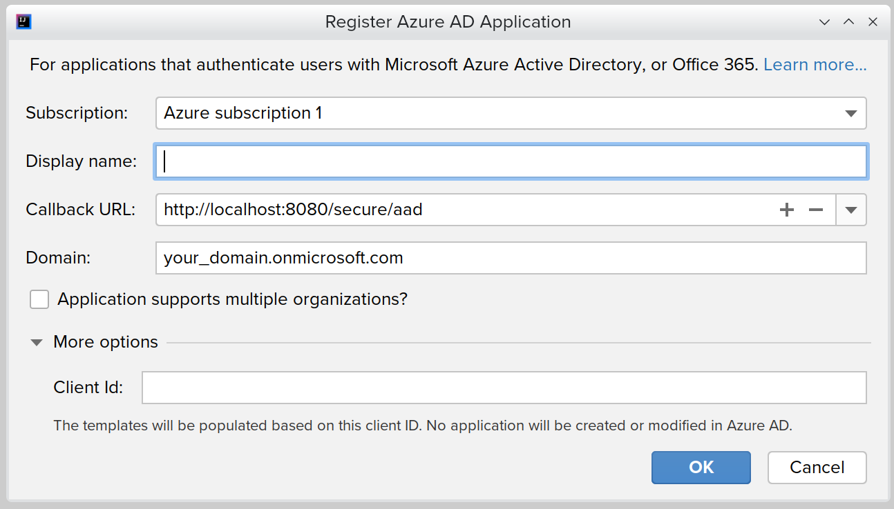
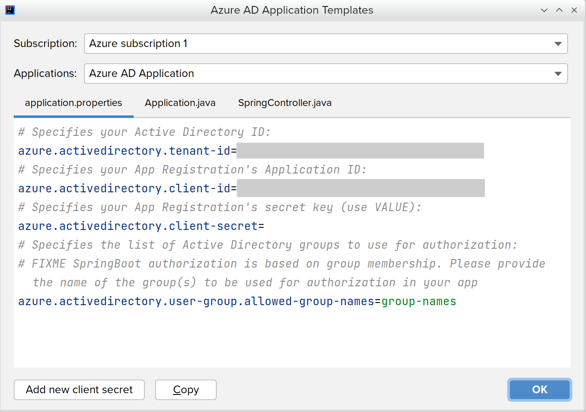
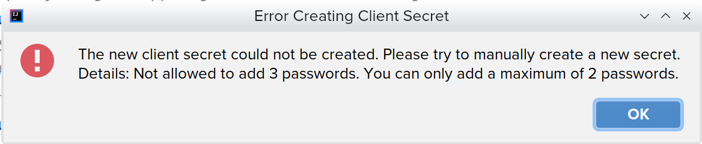
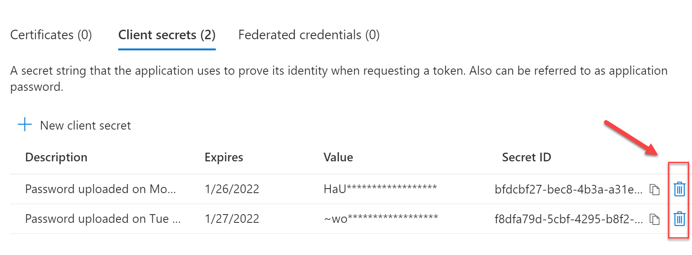

# Working with Azure Active Directory

The latest release of the Azure Toolkit for IntelliJ has added integration with Azure Active Directory to enable developers to quickly and efficiently implement authentication and authorization to their applications without leaving the comfort of the IDE.

This document will explain how to use the new feature to:
- Create a new Azure AD application
- View the code templates of existing Azure AD application

## Prerequisites

In order to work with Azure Active directory, you need to have an Azure Subscription and be signed in with the right account. If you don't have an Azure Subscription, you can get one for FREE [here](https://azure.microsoft.com/free).

## Create an Azure AD Application Registration
In this section, you'll use the Azure Toolkit for IntelliJ to create an Azure AD application registration. The registration is required so that you can sign in users and implement authorization (if so desired). You use the extension to first create the application. Upon the successful creation of the app registration the IDE will present you with the code template (settings).

1. Invoke the action `Register Azure AD Application` under `Tools > Azure > Register Azure AD Application`.

2. Choose the subscription you wish to use for the new application using the dropdown.
3. Enter the name of the new application.
4. Set up the callback URL. At least one callback URL is required.
5. Verify the domain. By default, the value is populated with the default domain of your Azure account.
6. Define if the new application should support just one or multiple tenants (i.e. organizations).
7. Click "OK" to create a new application with the defined settings in Azure AD. 
8. When the application was successfully created, the code templates for the new application are displayed in a new dialog.

"More options" allows you to manually define the client id. 
If the client ID is defined, then no new application will created in Azure Active Directory. The dialog box fields will be used to populate the code template dialog shown as the next step. The Client ID value must be a [UUID with 36 hexadecimal digits](https://en.wikipedia.org/wiki/Universally_unique_identifier#Format), e.g. `12345678-abcd-12345-abcd-123456789ab`.

## View Code Templates of Azure AD Applications
In this section, you use Azure Toolkit for IntelliJ to view code templates for existing Azure AD applications.
The code templates help you to quickly create a new application based on Spring Boot.

1. Invoke the action `Show Azure AD Application Templates` at `Tools > Azure > Show Azure AD Application Templates`.

2. Choose the subscription, which should be used to display the list of available application.
3. Choose the application to populate the code templates. The code templates are shown below the "Applications" dropdown. There are multiple file templates. Each tab displays a single file.
4. The code templates are populated with the selected application.

### How to Copy Code Templates
You can select text in a code template viewer and choose "Copy" in the context menu.

Alternatively, select the code template file and click the "Copy" button in the lower left corner of the dialog.  

### How to Set Up the Client Secret
The **Client Secret** value is only available for display in newly created application. If you don't know the Client Secret, it's still possible to add a new one for existing applications.

> Note: the client secret is only available while the dialog is shown. If you close the dialog before copying the secret, then you'll need to create new client secret using the button.

You can copy the secret by selecting the "application.properties" template and clicking "Copy". Alternatively, you can copy the line `azure.activedirectory.client-secret=...` from the "application.properties" template.

"Add new client secret" adds a new client secret to the selected application and refreshes the code templates. 

> Note: there's a maximum number of client secret you can add programmaticaly. If the limit has been reached, then an error message is displayed.

You can fix this issue by following these steps:

- Log into the Azure AD portal [aad.portal.azure.com](./readme.assets/aad.portal.azure.com)
- Navigate to **App Registrations**
- Find the application you're working with
- Navigate to **Certificates and Secrets**
- Delete one or more of the existing **Secret**

